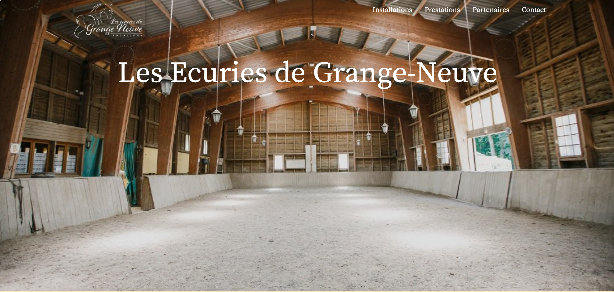
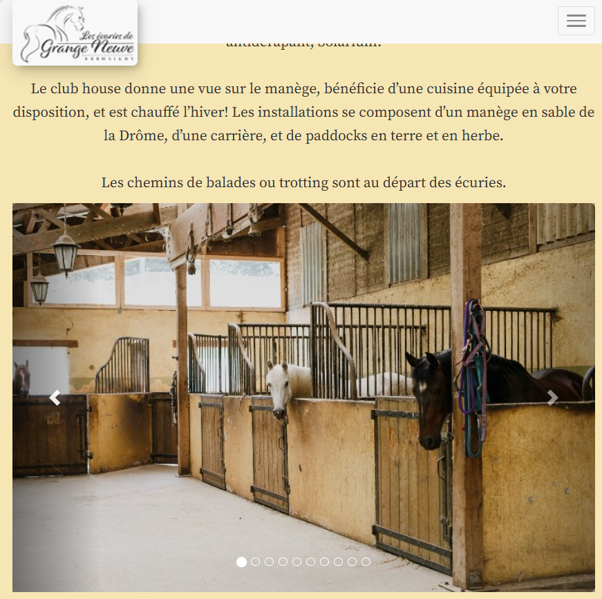
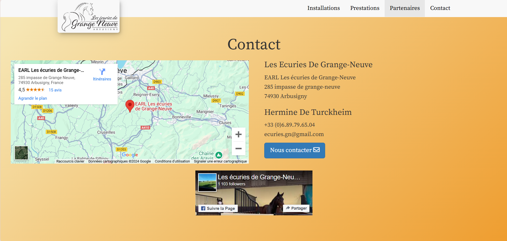

# Static website for local stables 
This website was for the stables "Ecuries de Granges Neuves" located at Arbusigny, France. 
It has been in production for 5 years. 

## Table of Contents
- [Installation](#installation)
- [Features](#features)

## Installation
1. Clone the repository:
```bash
 git clone https://github.com/karanilow/EcuriesGrangesNeuves.git
```

2. Visualize the website in your browser by clicking on the `Index.html` file in the root folder.



## Features
- Responsive UX for Mobile devices
- Useful links to Gmap and Facebook.
- Contact by mail form.







